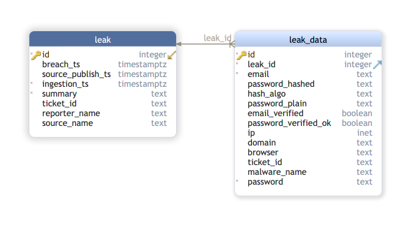

# credentialleakDB

[](https://github.com/EC-DIGIT-CSIRC/credentialLeakDB/actions/workflows/pylint.yml)
[](https://github.com/EC-DIGIT-CSIRC/credentialLeakDB/actions/workflows/python-app.yml)
[](https://github.com/EC-DIGIT-CSIRC/credentialLeakDB/actions/workflows/codeql-analysis.yml)

A database structure to store leaked credentials. 

Think: our own, internal HaveIBeenPwned database.

## Why?

1. To quickly find duplicates before sending it on to further process the data
2. To have a way to load diverse credential breaches into a common structure and do common queries on it
3. To quickly generate statistics on credential leaks
4. To have a well defined interface to pass on data to pass it on to other automation steps

## Documentation

Search in Confluence for "credentialLeakDB" in the Automation space.

SQL structure: [db.sql](db.sql)

The EER diagram __intentionally__ got simplified a lot. If we are going to store billions of repeated ``text`` datatype records, we can 
go back to more normalization. For now, however, this seems to be enough.




# Usage of the API

Here is how to use the API endpoints: you can start the server (follow the instructions below) and go to ``$servername/docs`` where $servername is of course the domain / IP address you installed it under. The ``docs/`` endpoint hosts a swagger / OpenAPI 3 

## GET parameters

These are pretty self-explanatory thanks to the swagger UI.

## POST and PUT

For HTTP POST (a.k.a INSERT into DB) you will need to provide the following JSON info:

### leak object
```json
{
  "id": 0,
  "ticket_id": "string",
  "summary": "string",
  "reporter_name": "string",
  "source_name": "string",
  "breach_ts": "2021-03-29T12:21:56.370Z",
  "source_publish_ts": "2021-03-29T12:21:56.370Z"
}

```

The ``id`` field *only* needs to be filled out when PUTing data there (a.k.a UPDATE statement). Otherwise please leave it out when POSTing a new leak_data row.
The id is the internal automatically generated primary key (ID) and will be assigned. So when you use the ``HTTP POST /leak`` endpoint, please leave out ``id``. The answer will be a JSON array with a dict with the id inside, such as:

```json
{
  "meta": {
    "version": "0.5",
    "duration": 0.006,
    "count": 1
  },
  "data": [
    {
      "id": 18
    }
  ],
  "error": null
}
```

Meaning: the version of the API was 0.5, the query duration was 0.006 sec (6 millisec), one answer. The ``data`` array contains one element: id=18. Meaning, the ID of the inserted leak object was 18. You can now reference this in the leak_data object insertion.

### leak_data object

Same as the leak object, here the ``id`` field *only* needs to be filled out when PUTing data there (a.k.a UPDATE statement). Otherwise please leave it out when POSTing a new leak_data row. **Note well**: the leak_id field needs to be filled out in this case. You **first** have to create leak object and then afterwards the leak_data object.

```json
{
  "id": 0,
  "leak_id": 0,
  "email": "user@example.com",
  "password": "string",
  "password_plain": "string",
  "password_hashed": "string",
  "hash_algo": "string",
  "ticket_id": "string",
  "email_verified": true,
  "password_verified_ok": true,
  "ip": "string",
  "domain": "string",
  "browser": "string",
  "malware_name": "string",
  "infected_machine": "string",
  "dg": "string"
}
```

## ``import/csv/`` endpoint

Also pretty self-explanatory. You need to first create a leak object, give it's ID as a GET-style parameter and upload the CSV in spycloud format via the Form.


## Installation

1. Install Postgresql:
```bash 
# in Ubuntu:
apt install postgresql-12
```

2. as user postgres:
```bash
createdb credentialleakdb
createuser credentialleakdb
psql -c "ALTER ROLE credentialleakdb WITH PASSWORD '<insert some random password here>'" template1
```
3. ``psql credentialleakdb < db.sql``
4. set the env vars: 
```bash
export PORT=8080
export DBNAME=credentialleakdb
export DBUSER=credentialleakdb
export DBPASSWORD=... <insert the password you gave the user> ...
export DBHOST=localhost
```
5. start the program from the main directory:
```bash
export PYTHONPATH=$(pwd); uvicorn --reload --host 0.0.0.0 --port $PORT api.main:app
```

## Configuration.

Please copy the file ``config.SAMPLE.py`` to ``api/config.py`` and adjust accordingly.
Here you can set API keys etc.


