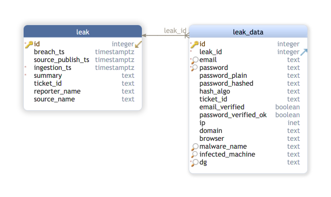

# credentialleakDB

[](https://github.com/EC-DIGIT-CSIRC/credentialLeakDB/actions/workflows/pylint.yml)
[](https://github.com/EC-DIGIT-CSIRC/credentialLeakDB/actions/workflows/python-app.yml)
[](https://github.com/EC-DIGIT-CSIRC/credentialLeakDB/actions/workflows/codeql-analysis.yml)

A database structure to store leaked credentials. 

Think: our own, internal HaveIBeenPwned database.

## Why?

1. To quickly find duplicates before sending it on to further process the data
2. To have a way to load diverse credential breaches into a common structure and do common queries on it
3. To quickly generate statistics on credential leaks
4. To have a well defined interface to pass on data to pass it on to other automation steps

## Documentation

Search in Confluence for "credentialLeakDB" in the Automation space.

SQL structure: [db.sql](db.sql)

The EER diagram __intentionally__ got simplified a lot. If we are going to store billions of repeated ``text`` datatype records, we can 
go back to more normalization. For now, however, this seems to be enough.





## Installation

1. Install Postgresql 
2. as user postgres:
```bash
createdb credentialleakdb
createuser credentialleakdb
```
3. ``psql credentialleakdb < db.sql``
4. set the env vars: 
```bash
export DBNAME=credentialleakdb
export DBUSER=credentialleakdb
```
5. start the program:
```bash
uvicorn --reload --host 0.0.0.0 --port 8080 api.main:app
```
